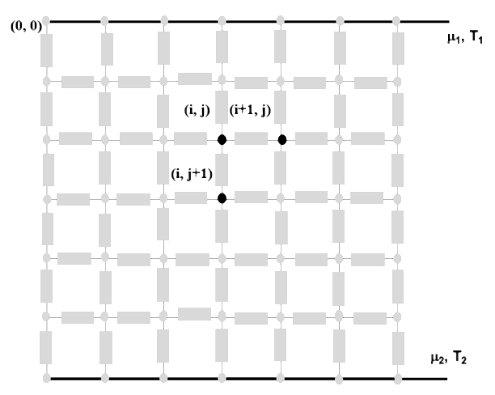

### PyDYCO

**PyDYCO** is a thermodynamic solver primarily used for thermoelectricity, with the acronym standing for **Dynamique Couplée**. This solver leverages **NgSpice** and **Python** to calculate the coupling between energy current and electric current in 2D materials.

### Features

- **Coupling Calculation**: PyDYCO computes the interaction between energy and electric currents in 2D materials.
- **Temperature and Electrochemical Potential**: The solver helps find the local temperature and electrochemical potential in the material.
- **Current Distribution**: It calculates the different currents in the material, providing valuable insights into thermoelectric properties.

### Software Used

- **PySpice** Library and **NgSpice** for circuit simulation.
- **Python** for Network creation and computation.
- **ParaView** for data visualization and post-processing.
  
### Installation of **PySpice**

To install **PySpice**, please refer to the official installation guide on [Fabrice Salvaire's website](https://pyspice.fabrice-salvaire.fr/).

### Usage

**PyDYCO** runs thermodynamic networks, and in this context, it's applied to thermoelectricity. The user defines the dimensions of the network, the size and properties of each element (thermoelectric dipole), the boundary conditions, and the operating mode.

Each dipole is defined by its length, cross-section, thermal and electrical conductivities, and finally, its heat capacity. In the case of macroscopic transport, the electrical capacity is neglected in comparison to the thermal one.

**PyDYCO** then calculates the coupling between the energy current and the electrical current in each dipole. It takes into account diffusive transport, the thermoelectric effect, and dissipation (Joule effect). Finally, a mapping of the temperature and electrochemical potential is displayed in **ParaView** at each node, along with the energy current, electrical current, and entropy current passing through each dipole.

### Demontration 

A demontration of **PyDYCO** solver is comming soon ...

